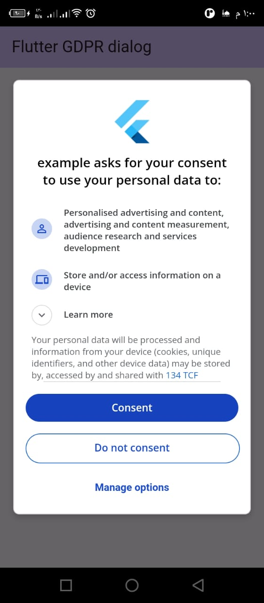

# Flutter GDPR Admob Package

This guide provides a basic understanding of how to use the `gdpr_admob` package in a Flutter application.

## Introduction

The `gdpr_admob` package helps you display a GDPR consent form to users within the European Economic Area (EEA) and initialize Google Mobile Ads based on user consent. This guide explains how to set it up in your Flutter app.



## Step-by-Step Guide

### 1. Add Dependencies

Add the following dependencies to your `pubspec.yaml` file:

```yaml
dependencies:
  flutter:
    sdk: flutter
  google_mobile_ads: ^5.1.0
  gdpr_admob: ^0.0.1
```

### 2. Import Packages

Import the required packages in your Dart file:

```dart
import 'package:flutter/material.dart';
import 'package:gdpr_admob/gdpr_admob.dart';
import 'package:google_mobile_ads/google_mobile_ads.dart';
```

### 3. Initializing GDPR

In your Stateful widget, create an instance of `GdprAdmob` and define a method to initialize it. This method will set the GDPR consent status for the user.

```dart
final GdprAdmob gdprAdmob = GdprAdmob();
bool _isLoading = false;
String? _errorMessage;
String? _consentStatus;

Future<void> _initializeGdpr() async {
  setState(() {
    _isLoading = true;
  });

  final error = await gdprAdmob.initialize(
    mode: DebugGeography.debugGeographyEea,
    testIdentifiers: ["WRITE_YOUR_TEST_DEVICE_IDENTIFIERS"],
  );

  if (error != null) {
    setState(() {
      _errorMessage = error.message;
    });
  }

  setState(() {
    getStatus();
    _isLoading = false;
  });
}
```

### 4. Getting Consent Status

Define another method to get the current consent status of the user.

```dart
getStatus() async {
  final status = await gdprAdmob.getConsentStatus();
  setState(() {
    _consentStatus = status;
  });
}
```

### 5. Displaying GDPR Dialog

You can now use these methods in your widget tree to display the GDPR dialog and get the consent status. You can also reset the consent status using the `resetConsentStatus` method.

```dart
ElevatedButton(
  onPressed: _initializeGdpr,
  child: const Text("Show GDPR dialog"),
),
ElevatedButton(
  onPressed: () async {
    await gdprAdmob.resetConsentStatus();
    getStatus();
  },
  child: const Text("Reset the consent state"),
),
if (_consentStatus != null)
  Text('Consent Status: $_consentStatus'),
if (_errorMessage != null) Text('Error: $_errorMessage'),
```

That's it! You have now integrated the `gdpr_admob` package into your Flutter application.
